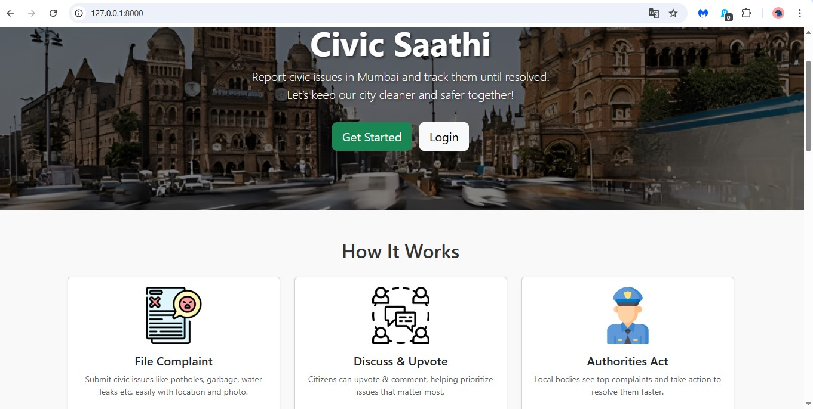

# ByteCamp-Hackathon
# Civic Saathi 
Empowering citizens to report and resolve local civic issues in Mumbai.

---

## About the Project
**Civic Saathi** is a web-based civic issue reporting platform built for Mumbai.  
It enables citizens to report local problems (like potholes, garbage, water leaks etc) with precise locations and photos, track their status, and collectively drive accountability.

---

## Problem it Solves
In many Indian cities, citizens face daily civic issues but lack an easy, transparent way to:
- report problems with exact location,
- track their status,
- and ensure local authorities act.

This platform bridges that gap, making the complaint process collaborative, transparent, and data-driven.

---

## Features
- File new complaints with photo & location on an interactive map
- Trending complaints highlighted based on upvotes
- Map view of unresolved issues
- Machine learning predicts category from description
- Comment & upvote on complaints to prioritize community concerns
- View complaint history & statuses
- Responsive design for web & mobile

---

## Screenshots

---

## Technologies Used
- **Backend:** Django, Python
- **Frontend:** HTML, CSS (Bootstrap), JavaScript
- **Database:** MySQL
- **ML:** scikit-learn for category prediction
- **Other:** Leaflet.js for maps, Django ORM, Decouple for environment variables
- 
---

## Challenges faced

- Integrating ML prediction (scikit-learn) into Django cleanly.
- Handling database schema changes and keeping migrations tidy.
- Making interactive Leaflet maps resize correctly in Bootstrap tabs.
- Ensuring all timestamps consistently store & display in Indian Standard Time (IST).

---

## Future Improvements
- Build an Admin / Authority Dashboard for municipal officials to track, update, and close complaints.
- Add email & SMS notifications to inform users when complaint statuses change or when they receive comments.
- Enhance ML with urgency & priority prediction, helping authorities triage complaints efficiently.
- Implement multi-language support (Marathi & Hindi) for wider reach and inclusivity.
- Develop mobile apps for Android/iOS for on-the-go complaint filing with instant GPS tagging.
- Introduce gamification elements like badges and leaderboards to motivate civic participation.
